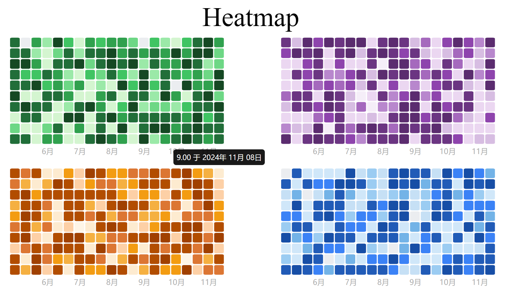

# README

## HOW TO USE

### `UMD`

HTML

```html
<!DOCTYPE html>
<html lang="en">
  <head>
    <meta charset="UTF-8" />
    <meta name="viewport" content="width=device-width, initial-scale=1.0" />
    <title>Document</title>
  </head>
  <body>
    <svg width="400" height="200"></svg>
  </body>
  <script src="node_modules/calender-heatmap/dist/heatmap.umd.js"></script>
  <script src="./test.js"></script>
</html>
```

`  <svg width="400" height="200"></svg>`----------------------------**宽高是必须使用的**，热力图是根据宽高来自动分配格子大小！

` <script src="node_modules/calender-heatmap/dist/heatmap.umd.js"></script>`----------------------**导入文件**

JS

`CalenderHeatmap`-导出的全局变量

`Heatmap`-热力图类

- DOM 元素
- 需要展示的数据
  - 格式固定为[[日期，值]，...]
  - 日期固定为 2021-10-2(`toLocaleDateString`形式)
- 选项(有默认选项)
  - x(Number)：一行有多少个
  - y(Number)：一列有多少个
  - color(String)：热力图的主题颜色(目前可供选择的有：green,purple,blue,orange)
  - cellSpacing(Number):单元格之间的间距
  - tipMonth(Object):
    - value(Boolean):是否显示热力图下面的月份
    - format(Function):显示的格式
  - tooltip(Object):
    - value(Boolean):是否显示悬停信息
    - format(Function):显示的信息

`paint()`-绘制方法

**示例：**

```js
const svg = document.querySelector("#svg");
const heatmap = new CalenderHeatmap.Heatmap(svg, data, options);
heatmap.paint();
```



**ESM**

示例：vue

```js
import { Heatmap } from 'calender-heatmap'
import { onMounted } from 'vue';


onMounted(() => {
  const heatmap = new Heatmap(
    document.querySelector('svg'),
    data
  )
  heatmap.paint();
})


//template
  <svg width="400" height="200"></svg>
```
